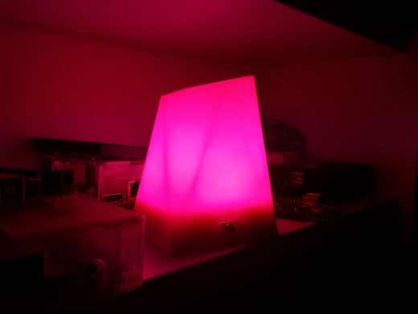

# Notti Android library #

[](https://travis-ci.org/akinaru/notti-library)
[ ](https://bintray.com/akinaru/maven/notti-library/_latestVersion)
[](LICENSE.md)

Notti library is an embedded Android service for controlling Notti Bluetooth devices

<hr/>

Notti is a small bluetooth led light with built in battery made by Witti



This project is composed of two modules :

* Android Service, exposing APIs to scan,connect and control a Notti device
* Android Application which control Notti through service APIs

## Notti Service

Android service that manage your Notti bluetooth device(s) through BLE GATT interfaces :

* set ON/OFF
* set RGB color
* set color intensity

<i>Characteristics on Notti cant be read on current device firmware. Previous state should be memorized to maintain statefull processing</i>

## Include into your project

Grab from Bintray maven repository :

```
compile 'akinaru:notti-library:0.21'
```

## Bind and/or Start Notti service

Bind your activity/service to `NottiBtService` : 

```
Intent intent = new Intent(context, NottiBtService.class);

startService(intent);

bound = bindService(intent, mServiceConnection, BIND_AUTO_CREATE);

if (bound){
	// you are bound to Notti service
}
else {
	// binding failure
}
```

And for your service connection : 

```
private ServiceConnection mServiceConnection = new ServiceConnection() {

	@Override
	public void onServiceConnected(ComponentName name, IBinder service) {

		Log.i(TAG, "Connected to service");

		NottiBtService nottiService = ((NottiBtService.LocalBinder) service).getService();
	}

	@Override
	public void onServiceDisconnected(ComponentName name) {

		Log.i(TAG, "Disconnected from service");
	}

};
```

## API Description

Notti service exposes a set of API, an application can uses in its own process

### Start a scan

Start a scan which will go on until a `stopScan()` is called :

```
boolean status = service.startScan();

if (status){
	// scan start request success
}
else {
	//scan start failure
}
```

### Stop a scan

```
service.stopScan();
```

### Get scanning list

This is a map of devices scanned until now. Only `Notti` devices will appear :

* key : Bluetooth address
* value : `BluetoothDevice` object

```
Map<String, BluetoothDevice> scanList = service.getScanningList();
```

### Get scaning status

```
boolean scanStatus = service.isScanning();

if (scanStatus){
	// currently scanning
}
else {
	// not scanning
}
```

### Clear scannning list

Empty the scanning list :

```
service.clearScanningList();
```

### Connect to device

Connect a device with its device address : 

```
service.connect("5C:31:3E:7F:81:1B");
```

<i>You can get device address from scanning list key item</i>

### Get list of devices

List of devices that have already been connected at least once since service start :

* key : Bluetooth address
* value : `IBluetoothDeviceConn` object featuring a Bluetooth connection object
```
HashMap<String, IBluetoothDeviceConn> connectionList = service.getConnectionList();
```

`IBluetoothDeviceConn` can be cast into `INottiDevice` to be able to control your Notti device : 

```
if (service.getConnectionList().get("5C:31:3E:7F:81:1B").getDevice() instanceof INottiDevice) {

	INottiDevice device = (INottiDevice) service.getConnectionList().get("5C:31:3E:7F:81:1B").getDevice();

}
```

### Disconnect from device

```
boolean status = service.disconnect("5C:31:3E:7F:81:1B");

if (status){
	// disconnection request complete
}
else {
	// disconnection failure
}
```

### Disconnect all devices

```
service.disconnectall();
```

## Events

You can receive events related to following actions :

* scan has started
* scan has ended
* a new device has been discovered
* a device has connected
* a device has disconnected

To receive those one of these events or all of them, you have to register a `BroadcastReceiver` object with following filters :

| Intent              | descriptions |
|--------------------|-------------------|
| BluetoothEvents.BT_EVENT_SCAN_START        | scan has started      |
| BluetoothEvents.BT_EVENT_SCAN_END         | scan has ended     |
| BluetoothEvents.BT_EVENT_DEVICE_DISCOVERED | a new device has been discovered and added to scanning list      |
| BluetoothEvents.BT_EVENT_DEVICE_CONNECTED     | a device has connected     |
| BluetoothEvents.BT_EVENT_DEVICE_DISCONNECTED            | a device has disconnected      |

For receiving all events :
```
IntentFilter intentFilter = new IntentFilter();
intentFilter.addAction(BluetoothEvents.BT_EVENT_SCAN_START);
intentFilter.addAction(BluetoothEvents.BT_EVENT_SCAN_END);
intentFilter.addAction(BluetoothEvents.BT_EVENT_DEVICE_DISCOVERED);
intentFilter.addAction(BluetoothEvents.BT_EVENT_DEVICE_CONNECTED);
intentFilter.addAction(BluetoothEvents.BT_EVENT_DEVICE_DISCONNECTED);
``` 

Register your `BroadCastReceiver` :

```
registerReceiver(mGattUpdateReceiver, intentFilter);
```

And your `mGattUpdateReceiver` looks like :

```
private final BroadcastReceiver mGattUpdateReceiver = new BroadcastReceiver() {

	@Override
	public void onReceive(Context context, Intent intent) {

		String action = intent.getAction();

		if (BluetoothEvents.BT_EVENT_SCAN_START.equals(action)) {

			Log.i("notti-app", "Scan has started");

		} else if (BluetoothEvents.BT_EVENT_SCAN_END.equals(action)) {

			Log.i("notti-app", "Scan has ended");

		} else if (BluetoothEvents.BT_EVENT_DEVICE_DISCOVERED.equals(action)) {

			BluetoothObject btDevice = BluetoothObject.parseArrayList(intent);

			if (btDevice != null) {
				Log.i("notti-app", "New device has been discovered : " + 
					btDevice.getDeviceName() + " - " + btDevice.getDeviceAddress());
			}

		} else if (BluetoothEvents.BT_EVENT_DEVICE_CONNECTED.equals(action)) {

			BluetoothObject btDevice = BluetoothObject.parseArrayList(intent);

			if (btDevice != null) {
				Log.i("notti-app", "Device connected : " + 
					btDevice.getDeviceName() + " - " + btDevice.getDeviceAddress());
			}

		} else if (BluetoothEvents.BT_EVENT_DEVICE_DISCONNECTED.equals(action)) {

			BluetoothObject btDevice = BluetoothObject.parseArrayList(intent);

			if (btDevice != null) {
				Log.i("notti-app", "Device disconnected : " + 
					btDevice.getDeviceName() + " - " + btDevice.getDeviceAddress());
			}

		} 
	}
};

````

You can parse device name and device address with `BluetoothObject` class as featured above.

## Notti application

This Android application bounds to Notti service to control your device(s)

You can do the following :

* scan network looking for your Notti devices
* connect to your devices,
* control all Notti device functions

## Requirements

This project require Android SDK lvl17+

## External Lib

* Color picker by Lars Werkman : https://github.com/LarsWerkman/HoloColorPicker

## Screenshots


